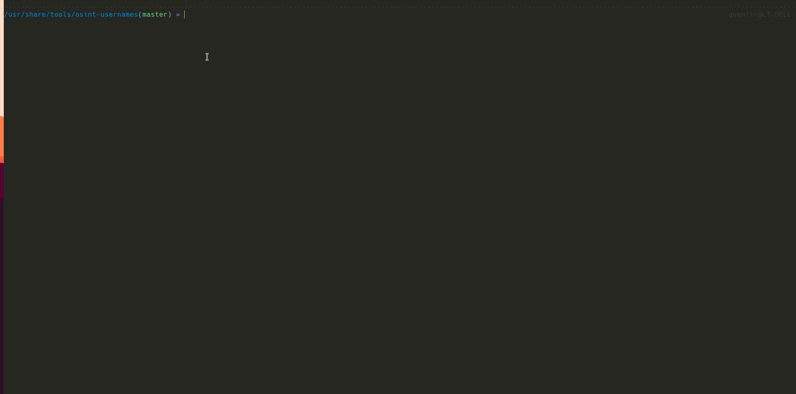

# generatedUsernamesWordlistByName.py

## Description

This tool allow you to generate a list of possible LDAP username based on a list of firstname and lastname.

```
⚠️ The possibilities that are generated are related to the LDAP format recommanded in the best practices.
```

## Example


